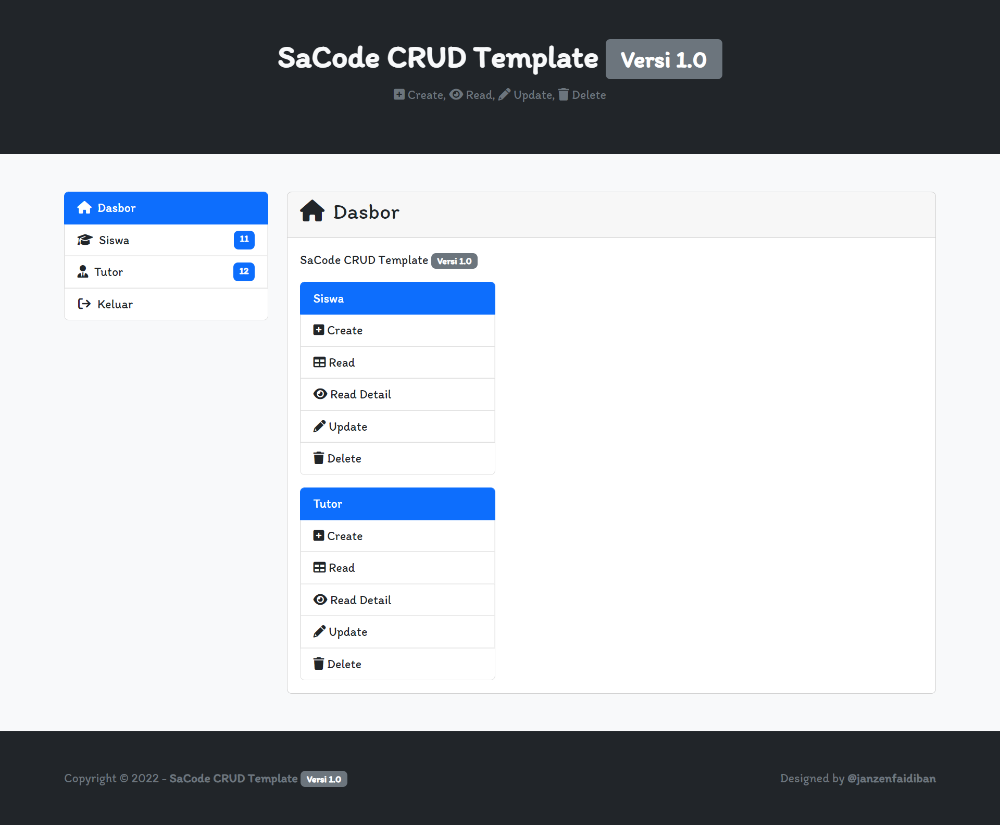
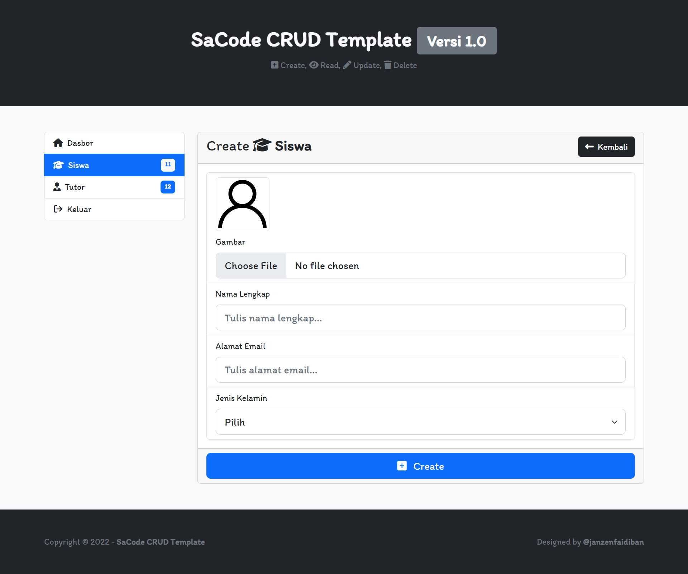
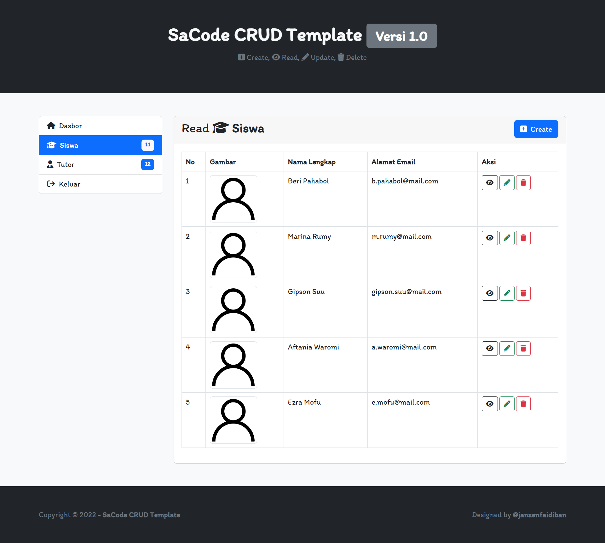
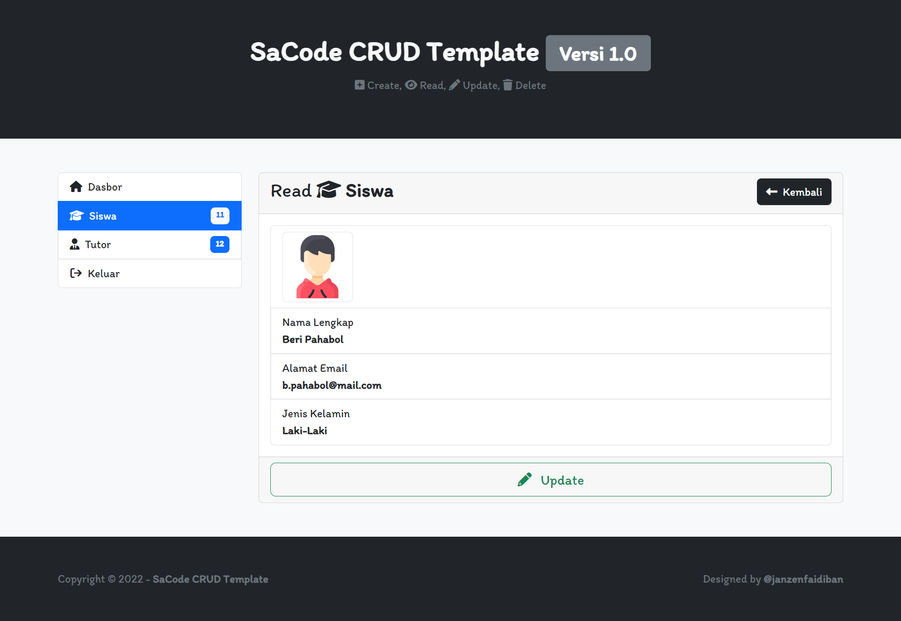
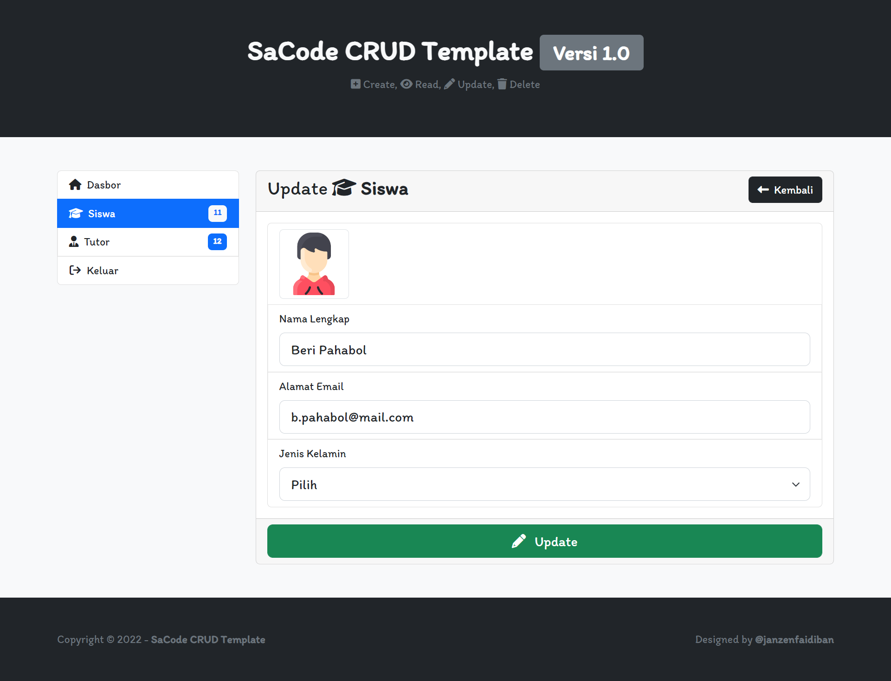
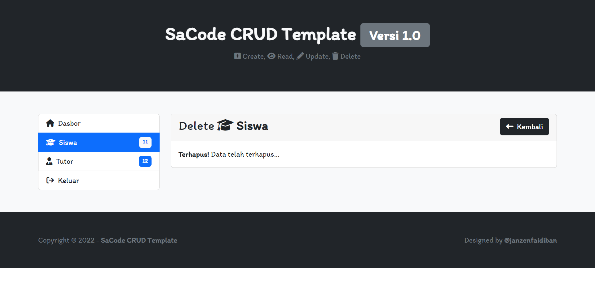

# SaCode CRUD Template

## Versi 1.0

[✅ Dasbor](#-dasbor-indexhtml)  
[✅ Siswa > Create](#-siswa--create-siswa-createhtml)  
[✅ Siswa > Read](#-siswa--read-siswa-readhtml)  
[✅ Siswa > Read Detail](#-siswa--read-detail-siswa-read-detailhtml)  
[✅ Siswa > Update](#-siswa--update-siswa-updatehtml)  
[✅ Siswa > Delete](#-siswa--delete-siswa-deletehtml)  

## Screenshot

### ✅ Dasbor (index.html)

### ✅ Siswa > Create (siswa-create.html)

### ✅ Siswa > Read (siswa-read.html)

### ✅ Siswa > Read Detail (siswa-read-detail.html)

### ✅ Siswa > Update (siswa-update.html)

### ✅ Siswa > Delete (siswa-delete.html)

